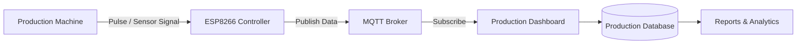
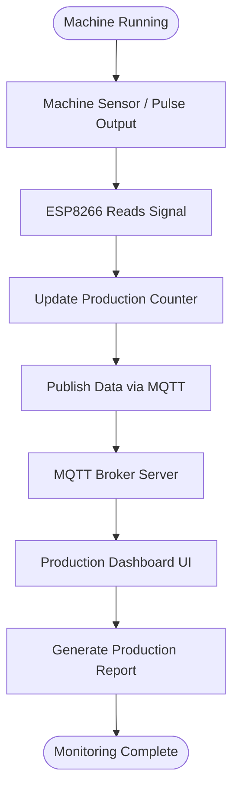
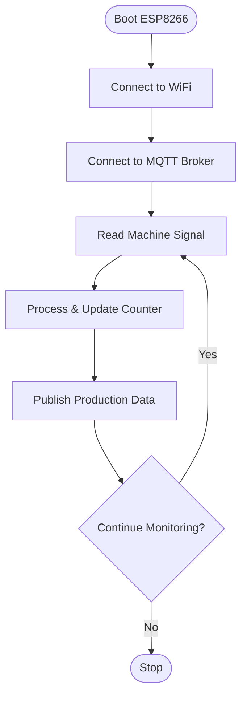
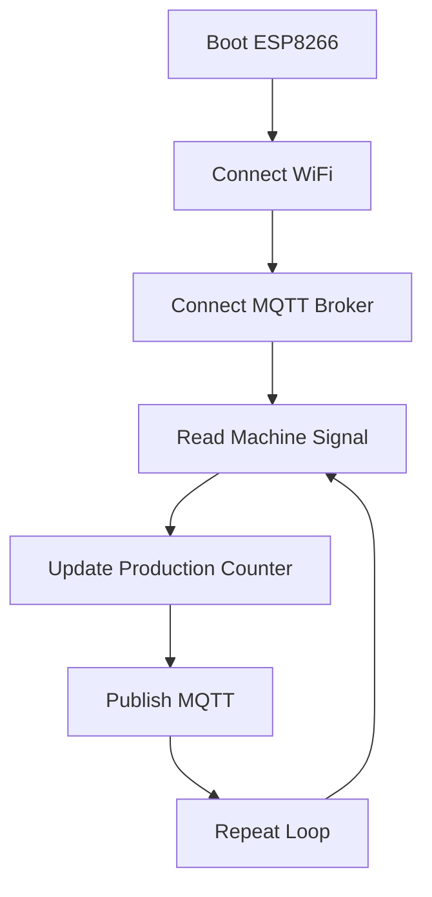

# 🏭 Laporan Produksi
### Industrial Production Reporting using ESP8266 & MQTT


Industrial **SCADA-based production monitoring system** that collects machine production data using **ESP8266**, sends it via **MQTT**, and displays it on a **real-time production dashboard**.

This system is designed for **Industrial IoT (IIoT)**, **factory automation**, and **production reporting systems**.

---

# 📊 System Overview

Production data flows through the following pipeline:

```
Machine → ESP8266 → MQTT Broker → UI Dashboard → Production Report
```

---

# 🧠 System Architecture



---

# ⚙️ Production Data Flow



---

# 🔁 ESP8266 Firmware Workflow


---

# 🏗 SCADA Layer Architecture

```
┌─────────────────────────────┐
│     Application Layer       │
│   Production Dashboard UI   │
└──────────────▲──────────────┘
               │
┌──────────────┴──────────────┐
│    Communication Layer      │
│        MQTT Broker          │
└──────────────▲──────────────┘
               │
┌──────────────┴──────────────┐
│        Control Layer        │
│          ESP8266            │
└──────────────▲──────────────┘
               │
┌──────────────┴──────────────┐
│         Field Layer         │
│      Machine Sensors        │
└─────────────────────────────┘
```

---

# 🔧 Hardware Components

| Component | Description |
|------|------|
| ESP8266 | Microcontroller for machine interface |
| Machine Sensor | Pulse / proximity / limit switch |
| Power Supply | 5V regulated |
| WiFi Network | Communication network |
| Industrial Machine | Production equipment |

---

# 💻 Software Stack

| Layer | Technology |
|------|------|
| Firmware | Arduino / ESP8266 SDK |
| Communication | MQTT |
| Broker | Mosquitto / EMQX |
| Backend | C# |
| Database | MySQL |
| UI | VB.NET |

---

# 📡 MQTT Topic Structure

Example topic structure used for machine monitoring.

```
factory/line1/machine1/information
factory/line1/machine1/counter
factory/line1/machine1/operator
```

Example payload:

```json
{
  "uid": "123",
  "count": 350,
  "operator": "mr. x",
  "total":1000,
  "timestamp": "2026-03-13T14:22:00"
}
```
---

# 🔁 ESP8266 Firmware Workflow



---

# 🧾 Example ESP8266 MQTT Publish

```cpp
#include <ESP8266WiFi.h>
#include <PubSubClient.h>

void publishProduction(int count) {

  String payload = "{";
  payload += "\"machine\":\"M01\",";
  payload += "\"count\":" + String(count);
  payload += "}";

  client.publish("factory/machine1/production", payload.c_str());
}
```

---

# 📈 System Features

- Real-time production monitoring
- MQTT-based industrial communication
- Lightweight IoT architecture
- Multi-machine scalability
- Production data logging
- Dashboard visualization

---

# 🏭 Industrial Use Cases

This system can be implemented for:

- Factory production monitoring
- Industrial IoT implementation
- Manufacturing analytics
- Machine utilization tracking
- Smart factory dashboards

---

# 📜 License

[**MIT License**](LICENSE)

---

# 👨‍💻 Author
**STEFFAN U**  
Industrial IoT & Automation Engineering Project  
SCADA • Embedded Systems • MQTT • Factory Automation
